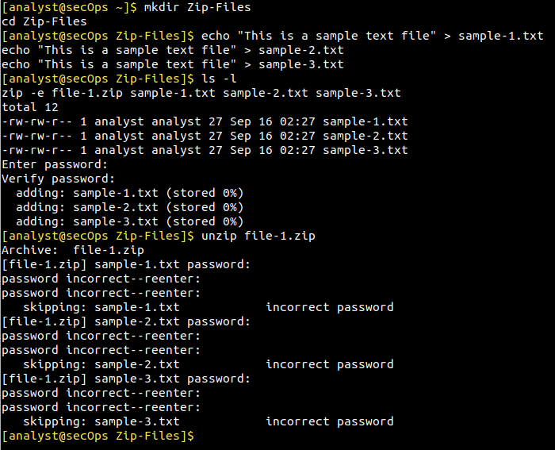
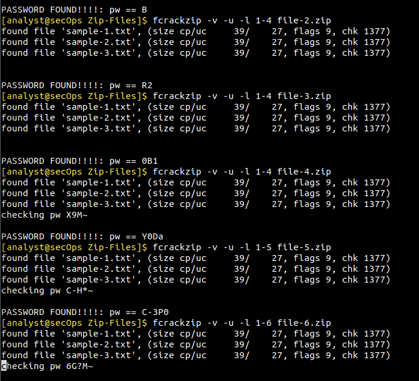

# Lab: Cifrado y Descifrado (Fuerza Bruta)

Documentación técnica de laboratorio enfocada en la recuperación de claves y auditoría de archivos en Linux.

---

## 📋 Descripción
Simulación de incidente corporativo. Un ejecutivo olvida la contraseña de un archivo crítico. El ejercicio abarca un entorno sandbox, cifrado simétrico y fuerza bruta.

---

## 🎯 Objetivos
* Crear y cifrar con `zip`.
* Simular error de clave.
* Usar `fcrackzip` para CPU.

---

## 🛠️ Herramientas
* OS: Security Linux
* Utils: bash, zip
* Tools: fcrackzip

---

## 🗺️ Estructura
* `~/` (Home)
  * `Zip-Files/` (Sandbox)
    * `sample-1.txt`
    * `sample-2.txt`
    * `sample-3.txt`
    * `file-1.zip` (1 car.)
    * `file-2.zip` (2 car.)
    * `file-3.zip` (3 car.)
    * `file-4.zip` (4 car.)
    * `file-5.zip` (5 car.)
    * `file-6.zip` (6 car.)

---

## ⚙️ Paso a Paso

### Paso 1: Entorno
```bash
cd ~
mkdir Zip-Files
cd Zip-Files
```

Archivos base:
```bash
echo "Text" > sample-1.txt
echo "Text" > sample-2.txt
echo "Text" > sample-3.txt
```

### Paso 2: Cifrado
Cifrado interactivo:
```bash
ls -l
zip -e file-1.zip sample-1.txt sample-2.txt sample-3.txt
```

Prueba de error:
```bash
unzip file-1.zip
```

> **Evidencia 1:**
> 

### Paso 3: Fcrackzip
Ataque por rango (`-l`):
```bash
fcrackzip -v -u -l 1-6 file-6.zip
```

> **Evidencia 2:**
> 

---

## 🔍 Comandos
* `zip -e`: Cifrado
* `unzip`: Extracción
* `fcrackzip`: Fuerza bruta

---

## 💡 Verificaciones
* Integridad comprobada.
* Rechazo de claves.
* Costo de CPU.

---

## 🧠 Conceptos
* **Simétrico:** Clave compartida.
* **Espacio:** Longitud.
* **Higiene:** Claves robustas.

---

## 🚀 Mejoras
* Diccionarios (`rockyou`).
* Scripts en Bash.

---

## 🏆 Conclusión
Práctica clave para SOC y prevención de fugas.
